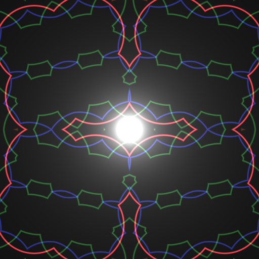
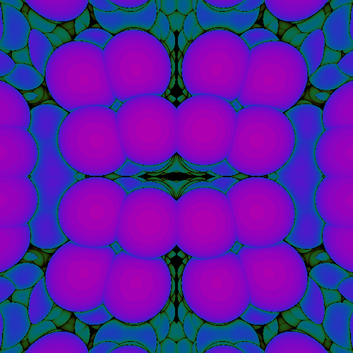
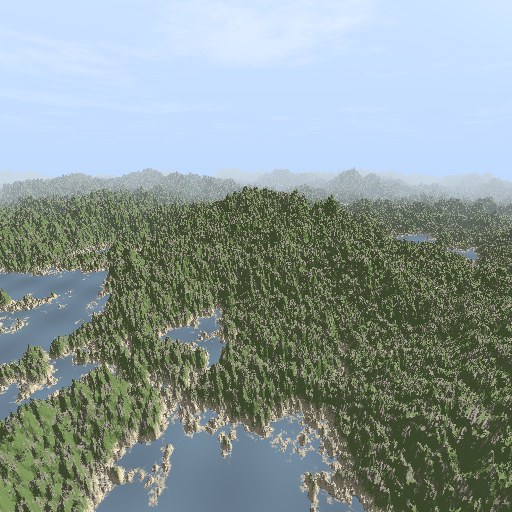
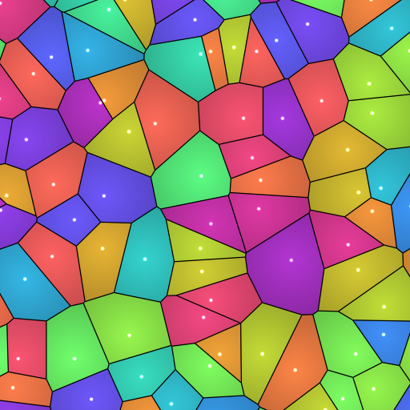

# @tir.jp/glsl2png

[](https://www.npmjs.com/package/@tir.jp/glsl2png)
[](https://github.com/ayamada/glsl2png/blob/main/LICENSE)

Render GLSL fragments to PNG or standalone HTML using Puppeteer and WebGL2.

This tool is designed to facilitate an incremental development cycle for fragment shaders, allowing you to quickly iterate on your GLSL code and verify the results.

## Features

- **glsl2png**: Render a GLSL fragment shader to a PNG image.
- **glsl2html**: Generate a standalone, responsive HTML file that runs the shader in a browser.
- **Headless & Visible**: Supports headless rendering for CI/CD or visible mode for live preview.
- **Multi-frame Support**: Specify multiple time points to generate a sequence of images.
- **WebGL2 Support**: Built for modern GLSL (ES 300).

## Installation

```bash
npm install -g @tir.jp/glsl2png
```

Or use it directly via `npx`:

```bash
npx @tir.jp/glsl2png --help
```

## Usage

### glsl2png

Render a shader to a PNG file.

```bash
glsl2png <fragment_shader_path> [options]
```

**Options:**
- `--width <number>`: Canvas width (default: 512).
- `--height <number>`: Canvas height (default: 512).
- `--time <number>`: Time value to pass as `u_time`. Can be specified multiple times for multiple outputs.
- `--out <path>`: Output PNG path (default: `output.png`).
- `--no-headless`: Launch browser in non-headless mode for live preview.

**Example:**
```bash
# Single image at time 1.0
glsl2png samples/basic.frag --time 1.0 --out result.png

# Multiple images (generates animation_0.png, animation_1.png, ...)
glsl2png samples/basic.frag --time 0.0 --time 0.5 --time 1.0 --out animation.png
```

### glsl2html

Generate a standalone HTML file. It is auxiliary tool for share glsl animation easily.

```bash
glsl2html <fragment_shader_path> [options]
```

**Options:**
- `--width <number>`: Canvas width (default: 512).
- `--height <number>`: Canvas height (default: 512).
- `--out <path>`: Output HTML path (default: `output.html`).

**Example:**
```bash
glsl2html samples/basic.frag --out preview.html
```

## GLSL Requirements (WebGL2)

Your fragment shaders should follow the WebGL2 (ES 300) specification:

- **Header**: Must include `#version 300 es`.
- **Precision**: Must define precision, e.g., `precision highp float;`.
- **Output**: Use `out vec4 fragColor;` instead of `gl_FragColor`.
- **Built-in Uniforms**:
  - `uniform vec2 u_resolution;`: Canvas resolution (width, height) in pixels.
  - `uniform float u_time;`: Current time in seconds.

### Example Shader (`basic.frag`)

```glsl
#version 300 es
precision highp float;

uniform vec2 u_resolution;
uniform float u_time;

out vec4 fragColor;

void main() {
    vec2 uv = gl_FragCoord.xy / u_resolution;
    vec3 col = 0.5 + 0.5 * cos(u_time + uv.xyx + vec3(0, 2, 4));
    fragColor = vec4(col, 1.0);
}
```

And see [samples/](samples/) directory.

## Gallery

### Fractal KIFS
```bash
glsl2png samples/fractal_kifs.frag --out img/fractal_kifs.png --time 1.0
```


### Fractal Raymarching
```bash
glsl2png samples/fractal_raymarching.frag --out img/fractal_raymarching.png --time 1.0
```


### Nature
```bash
glsl2png samples/nature.frag --out img/nature.png --time 1.0
```


### Voronoi
```bash
glsl2png samples/voronoi.frag --out img/voronoi.png --time 1.0
```


## License

Zlib License.
